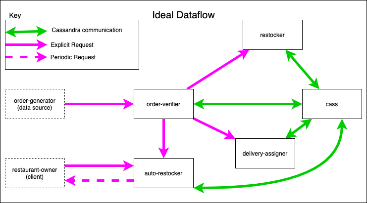
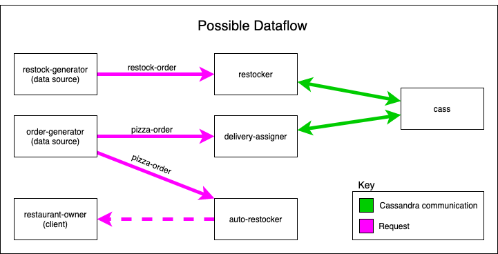

# Dataflow

Due to the nature of this project, where clients can specify their desired workflow out of a subset of components, the dataflow is expected to change.   

## Ideal Dataflow

Figure 1.0

Pictured above in Figure 1.0 is the ideal dataflow for the project when all components are deployed for a specified workflow. In this workflow two components are essential, the order-verifier and cass. Components restocker, delivery-assigner, and auto-restocker can be removed with no significant impact on the dataflow.

### Dataflow Walk-through

The order-generator sends a pizza-order json to the order-verifier. The order-verifier recieves the pizza-order and verifies that the json is valid. Then it attempts to create the order.

If the store does not have the requested ingredients in the required quantites to satify the pizza-order and the restocker component is present in the current workflow, the order-verifer sends a restock-order to the restocker component. If the restocker component is not present in the current workflow the order is rejected.

The restocker, upon recieving the restock-order, will communicate with cass to increase the stock for the given items in the database. After doing so, it will return a success message to the caller.

If order creation for the pizza-order was successful and the delivery-assigner component is in the current workflow, then the order-verifier forwards the pizza-order to the delivery-assigner.

The delivery-assigner, upon recieving the order will communicate with cass and a google api to assign the best delivery-entity to the given order. After doing so it will return the pizza-order with additional fields estimated time and delivery-entity to the caller.

After calling restocker and delivery-assigner (if present in the workflow), the order-verifier will forward the pizza-order to auto-restocker, if auto-restocker is in the current workflow.

auto-restocker, upon recieving an order will store the indgridient usage information to send a periodic precidtion to the restaurant-owner. 

The restaurant-owner can also make an explicit call to the auto-restocker for a prediction.

The order-verifier, after contacting the restocker, delivery-assigner, and auto-restocker (if they are in the current workflow), will send a success message back to the order-generator.

Figure 2.0

Pictured above in Figure 1.0 is the other possible dataflow for the project when all components save the order-verifier are deployed for a specified workflow. In this workflow one components are essential, cass. Components restocker, delivery-assigner, and auto-restocker can be removed with no significant impact on the dataflow.

### Dataflow walk-through
The order-generator sends a pizza-order json to the delivery-assigner and auto-restocker components, if they are present in the workflow.

The delivery-assigner, upon recieving the order will communicate with cass and a google api to assign the best delivery-entity to the given order. After doing so it will return the pizza-order with additional fields estimated time and delivery-entity to the caller.

auto-restocker, upon recieving an order will store the indgridient usage information to send a periodic precidtion to the restaurant-owner. 

The restaurant-owner can also make an explicit call to the auto-restocker for a prediction.

The restock-generator sends a restock-order json to the restocker, if it is present in the workflow.

The restocker, upon recieving the restock-order, will communicate with cass to increase the stock for the given items in the database. After doing so, it will return a success message to the caller.
